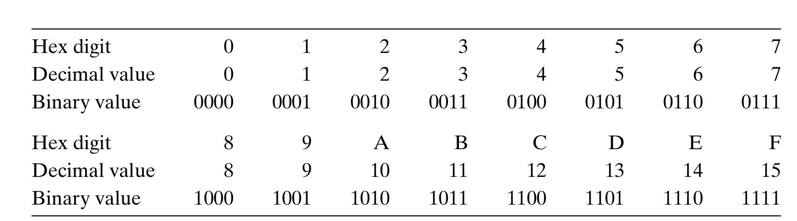
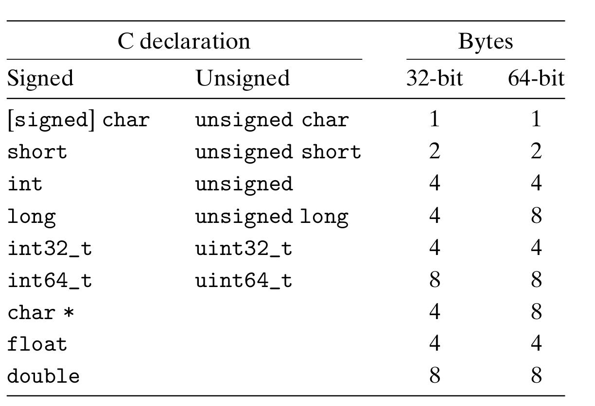

import {Aside} from 'astro-pure/user';
import {Label} from 'astro-pure/user';

## 信息存储

### 十六进制表示法

十进制和十六进制表示之间的转换需要使用乘法或者除法来处理.一般情况,将一个十进制数字$x$转换为十六进制，可以反复地用$16$除$x$,得到一个商$q$和一个余数$r$,也就是$x=q\times16+r$.然后，我们用十六进制数字表示的$r$作为最低位数字,并且通过对$q$反复进行这个过程得到剩下的数字。

例如,考虑十进制$314156$的转换:
$$
\begin{aligned}
314156 & = 19635 \times 16 + 12 &\qquad (C)\\
19635 & = 1227 \times 16 + 3 &\qquad (2)\\
1227 & = 76 \times 16 + 11 &\qquad(B) \\
76 & = 4 \times 16 + 12 &\qquad (C)\\
4 & = 0 \times 16 + 4 &\qquad (4)
\end{aligned}   
$$
所以,十进制数$314156$的十六进制表示为$\mathrm{0x4CB2C}$.

同样的,将一个十六进制数字转换为十进制数字，我们可以用相应的$16$的幂乘以每个十六进制数字。

例如:将十六进制数$\mathrm{0x7AF}$转换为十进制:
$$
7\times 16^2 + 10 \times 16^1 + 15 \times 16^0 = 7 \times 256 + 10 \times 16 + 15 \times 1 = 1967
$$

### 字数据的大小
<Aside type = 'tip' title='寻址范围'>
对于字长为$w$的计算机,它的寻址范围为$0\sim 2^w-1$,程序可以访问$2^w$字节.
32位字长限制虚拟地址空间为4千兆字节(写作4GB),扩展到 64 位字长使得虚拟地址空间为16EB, 大约是$1.84\times10^{19}$字节。
</Aside>

下图为 `C语言` 中的数据类型的大小,其中` int `和` long `的大小与编译器有关,通常在32位系统中为4字节,在64位系统中为8字节.

### 寻址和字节顺序

## 整数运算

### 无符号加法

对于满足$0\le x,y\le 2^w$的$x$和$y$有
$$
x+^u_w y=
\begin{cases}
x+y,x+y< 2^w\\
x+y-2^w,x+y>2^w
\end{cases}
$$

<Aside title='检测无符号加法的溢出'>
对于满足$0\le x,y\le 2^w$的$x$和$y$,如果$x+y< x$或者$x+y< y$,则溢出.
</Aside>

### 补码加法
对于满足$TMin_w \le x,y \le TMax_w$的$x$和$y$有
$$
x+^t_w y=
\begin{cases}
x+y-2^w,&x+y\ge2^{w-1}\qquad\qquad&\text{正溢出}\\
x+y,&-2^{w-1}\le x+y< 2^{w-1}\\
x+y+2^w,&x+y< -2^{w-1}\qquad\qquad&\text{负溢出}
\end{cases}
$$

<Aside title='检测补码加法的溢出'>
对于满足$TMin_w \le x,y \le TMax_w$的$x$和$y$,如果$x< 0,y< 0$且$x+y>0$则负溢出;如果$x>0,y>0$且$x+y< 0$,则正溢出.
</Aside>

### 补码的非

对于满足$TMin_w \le x\le TMax_w$的$x$有
$$
-^t_w x =
\begin{cases}
TMin_w, &x=TMax_w\\
-x,&x>TMin_w
\end{cases}
$$

> **补码的非的位级表示**
>
> 方法1: 将$x$的每一位取反,然后加1.
> 即-x与~x+1的值是相同的.
>
> 方法2: 假设$x$的位级表示为
> $$
> [x_{w-1},x_{w-2},\cdots,x_{k+1},1,0,\cdots,0]
> $$
> 其中,$k$为最右边的一个$1$,只要$x\ne0$,就一定存在这样的$k$.
>
> 那么$-^t_w x$的位级表示为
> $$
> [\verb|~|x_{w-1},\verb|~|x_{w-2},\cdots,\verb|~|x_{k+1},1,0,\cdots,0]
> $$

### 无符号乘法
对于满足$0\le x,y\le UMax_w$的$x$和$y$有
$$
x *^u_w y=(x\cdot y)\bmod 2^w
$$

### 补码乘法
对于满足$TMin_w \le x,y \le TMax_w$的$x$和$y$有
$$
x*^t_w y=U2T_w((x\cdot y)\bmod 2^w)
$$

### 乘以常数
**乘以$2$的幂**

设无符号整数$x$的位级表示为$[x_{w-1},x_{w-2},\cdots,x_0]$,那么,对于任意的$k\ge0$,
向$x$的右侧加$k$个$0$得到$[x_{w-1},x_{w-2},\cdots,x_0,\cdots,0]$这是$x2^k$的位级表示

**与$2$的幂相乘的无符号乘法**

对于无符号整数$x$和$k$,其中$0\le k< w$,C表达式`x<<k`会得到$x*^u_w2^k$

**与$2$的幂相乘的补码乘法**

对于补码$x$和无符号整数$k$,其中$0\le k< w$,C表达式`x<<k`会得到$x*^u_w2^k$

对于一组$0$和$1$交替的序列
$$
[(0\cdots 0)(1\cdots 1)\cdots(0\cdots 0)(1\cdots 1)]
$$
对于一组从位位置$n$到位位置$m$的连续的$l$($n\le m$).可以用下面两种不同形式中的一种来计算这些位对乘积的影响

$$
\begin{aligned}
&\text{形式A}:(x<<n)+(x<<(n-1))+\cdots+(x<<m)\\
&\text{形式B}:(x<<(n+1))-(x<<m)
\end{aligned}
$$

### 除以2的幂
